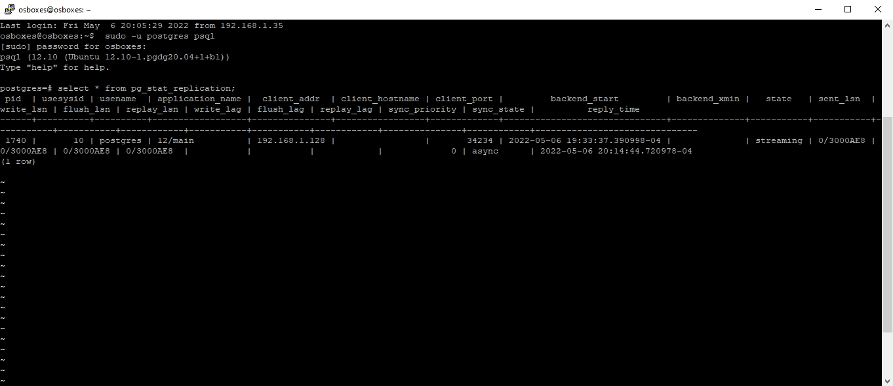
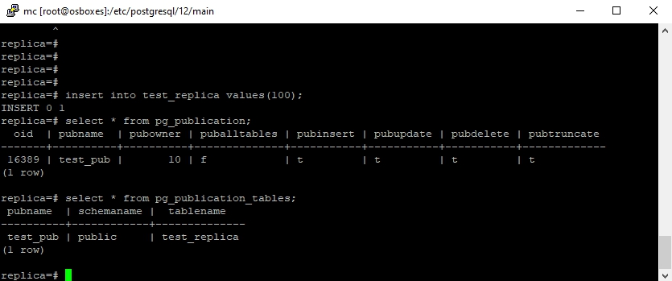
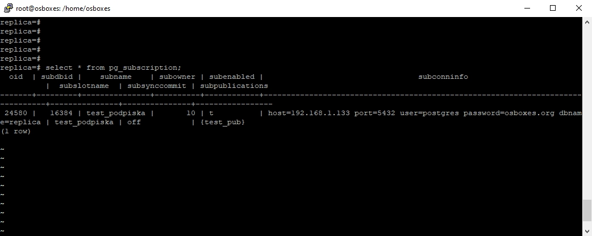

# Домашнее задание по теме "PostgreSQL: репликация"

## Физическая репликация

На скриншоте представлена статистика о репликации на сервер 192.168.1.128.

## Логическая репликация

На публикующем сервере создана публикация test_pub, в которую включена таблица test_replica.

На принимающем сервере создана подписка test_podpiska.
