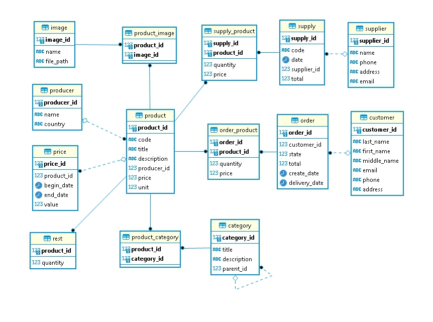

# Домашнее задание по теме "Проектирование БД"

## Содержание

* [Схема](#Схема)
* [Документация](#Документация)
* [Примеры бизнес-задач, которые решает база данных](#Примеры-бизнес-задач-которые-решает-база-данных)
* [Рекомендации к использованию репликации](#Рекомендации-к-использованию-репликации)
* [Рекомендации к резервному копированию](#Рекомендации-к-резервному-копированию)

## Схема

## Документация

Описание базы данных пожно посмотреть [в документации](https://github.com/eugeniyas/otus-databases/blob/main/L1HW1/documentation.pdf).

## Примеры бизнес-задач, которые решает база данных

- хранение информации о товарах, ценах, поставщиках и поставках, производителях, покупателях и заказах
- поиск данных по запросам пользователей
- анализ и составление отчетов

## Рекомендации к использованию репликации

## Рекомендации к резервному копированию
