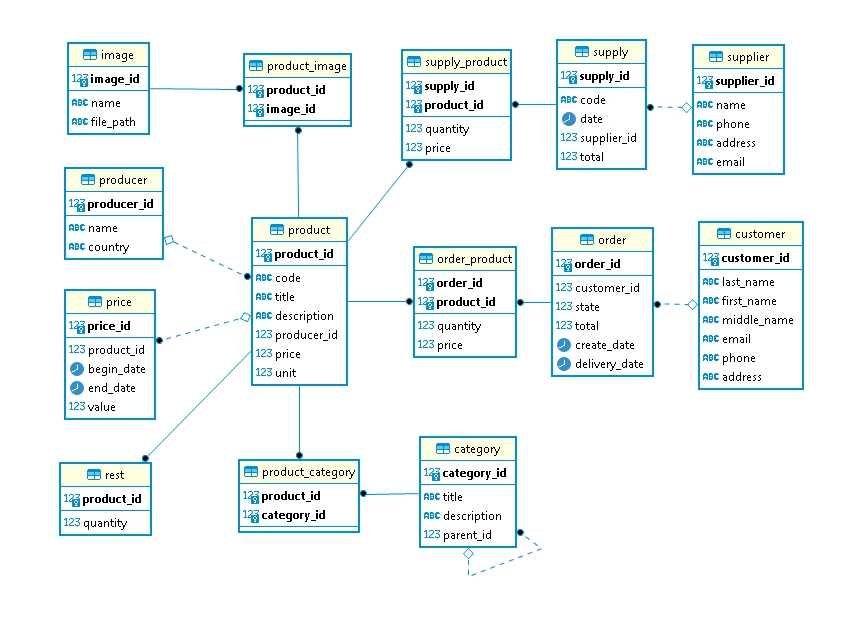

# Домашнее задание по теме "Компоненты современной СУБД"

База данных спроектирована для типового интернет-магазина.

## Содержание

* [Схема](#Схема)
* [Документация](#Документация)
* [Примеры бизнес-задач, которые решает база данных](#Примеры-бизнес-задач-которые-решает-база-данных)
* [Рекомендации к использованию репликации](#Рекомендации-к-использованию-репликации)
* [Рекомендации к резервному копированию](#Рекомендации-к-резервному-копированию)
* [Ограничения](#Ограничения)
* [Индексы](#Индексы)

## Схема

## Документация

Описание базы данных можно посмотреть [в документации](https://github.com/eugeniyas/otus-databases/blob/main/L1HW1/documentation.pdf).

## Примеры бизнес-задач, которые решает база данных

- ввод и хранение информации о товарах, ценах, поставщиках и поставках, производителях, покупателях и заказах
- поиск данных по запросам пользователей
- анализ и составление отчетов

## Рекомендации к использованию репликации

С целью повышения отказоустойчивости и производительности рекомендуется иметь несколько серверов, взаимодействие между которыми организовать с помощью логической репликации.

## Рекомендации к резервному копированию

С целью предотвращения потери данных рекомендуется настроить автоматическое создание бэкапов, которые необходимо хранить на удаленном сервере и регулярно проверять.

## Ограничения

product_un - уникальный ключ по полю code в таблице product: артикул продукта имеет уникальное значение
supply_un - уникальный ключ по полю code в таблице supply: код поставки имеет уникальное значение
price_check - ограничение (begin_date <= end_date) в таблице price: дата начала действия цены меньше или равна дате окончания действия цены

## Индексы
